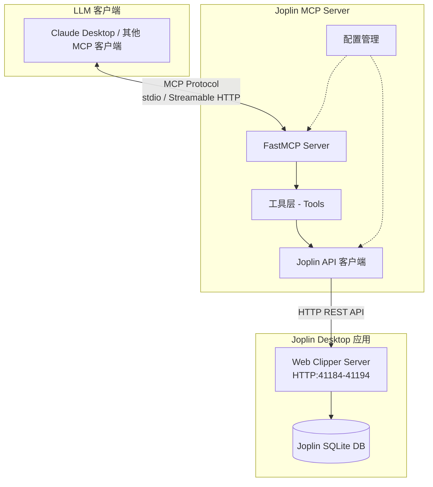

# Joplin MCP 服务设计文档

## 1. 项目概述

### 1.1 项目目标
构建一个基于 FastMCP 的无状态 MCP 服务器，将 Joplin REST API 转换为 MCP 工具，使 LLM 能够直接与 Joplin 笔记应用交互。

### 1.2 设计原则
- **无状态设计**：不引入额外数据库，所有数据存储在 Joplin 中
- **API 映射**：将 Joplin REST API 端点映射为 MCP 工具
- **简洁优先**：使用 FastMCP 装饰器模式，减少样板代码
- **配置驱动**：通过环境变量管理配置（端口、Token）

---

## 2. 系统架构



---

## 3. 项目结构

```
joplin-mcp/
├── pyproject.toml              # 项目配置和依赖
├── README.md                   # 项目说明
├── .env.example                # 环境变量模板
├── src/
│   └── joplin_mcp/
│       ├── __init__.py
│       ├── server.py           # FastMCP 服务器入口
│       ├── config.py           # 配置管理
│       ├── client.py           # Joplin API 客户端
│       ├── exceptions.py       # 自定义异常
│       └── tools/
│           ├── __init__.py
│           ├── notes.py        # 笔记工具
│           ├── folders.py      # 笔记本工具
│           ├── tags.py         # 标签工具
│           ├── resources.py    # 资源工具
│           └── search.py       # 搜索工具
├── tests/
│   ├── __init__.py
│   ├── conftest.py
│   ├── test_notes.py
│   ├── test_folders.py
│   └── test_integration.py
└── docs/
    ├── joplin_api.md           # Joplin API 参考
    └── deployment.md           # 部署指南
```

---

## 4. 核心模块设计

### 4.1 配置模块 ([`config.py`](src/joplin_mcp/config.py))

```python
from pydantic import BaseModel, Field
from pydantic_settings import BaseSettings

class JoplinSettings(BaseSettings):
    """Joplin API 配置"""
    host: str = Field(default="localhost", description="Joplin 主机")
    port: int = Field(default=41184, description="Joplin 端口")
    token: str = Field(..., description="Joplin API Token")
    
    @property
    def base_url(self) -> str:
        return f"http://{self.host}:{self.port}"

class Settings(BaseSettings):
    """MCP 服务器配置"""
    joplin: JoplinSettings = Field(default_factory=JoplinSettings)
    server_name: str = "Joplin"
    debug: bool = False
    
    class Config:
        env_prefix = "JOPLIN_MCP_"
        env_nested_delimiter = "__"
```

**环境变量示例** (`.env`):
```bash
JOPLIN_MCP_JOPLIN__TOKEN=your_api_token_here
JOPLIN_MCP_JOPLIN__PORT=41184
JOPLIN_MCP_DEBUG=false
```

### 4.2 Joplin API 客户端 ([`client.py`](src/joplin_mcp/client.py))

```python
import httpx
from typing import Optional, Any

class JoplinClient:
    """Joplin REST API 客户端封装"""
    
    def __init__(self, base_url: str, token: str):
        self.base_url = base_url
        self.token = token
        self._client = httpx.AsyncClient(
            base_url=base_url,
            params={"token": token}
        )
    
    async def get(self, endpoint: str, params: Optional[dict] = None) -> Any:
        """GET 请求"""
        response = await self._client.get(endpoint, params=params)
        response.raise_for_status()
        return response.json()
    
    async def post(self, endpoint: str, data: dict) -> Any:
        """POST 请求"""
        response = await self._client.post(endpoint, json=data)
        response.raise_for_status()
        return response.json()
    
    async def put(self, endpoint: str, data: dict) -> Any:
        """PUT 请求"""
        response = await self._client.put(endpoint, json=data)
        response.raise_for_status()
        return response.json()
    
    async def delete(self, endpoint: str, permanent: bool = False) -> Any:
        """DELETE 请求"""
        params = {"permanent": "1"} if permanent else {}
        response = await self._client.delete(endpoint, params=params)
        response.raise_for_status()
        return response.json()
    
    async def close(self):
        await self._client.aclose()
```

### 4.3 服务器入口 ([`server.py`](src/joplin_mcp/server.py))

```python
from fastmcp import FastMCP
from .config import Settings
from .client import JoplinClient

def create_mcp_server(settings: Settings) -> FastMCP:
    """创建 MCP 服务器实例"""
    mcp = FastMCP(
        name=settings.server_name,
        dependencies=["httpx", "pydantic"]
    )
    
    # 注册工具
    from .tools import notes, folders, tags, resources, search
    notes.register_tools(mcp, settings)
    folders.register_tools(mcp, settings)
    tags.register_tools(mcp, settings)
    resources.register_tools(mcp, settings)
    search.register_tools(mcp, settings)
    
    return mcp

# 服务器实例
settings = Settings()
mcp = create_mcp_server(settings)

if __name__ == "__main__":
    mcp.run()
```

---

## 5. 工具设计

### 5.1 笔记工具 ([`tools/notes.py`](src/joplin_mcp/tools/notes.py))

| 工具名 | 描述 | Joplin API 端点 |
|--------|------|----------------|
| `list_notes` | 获取笔记列表 | GET /notes |
| `get_note` | 获取单个笔记详情 | GET /notes/:id |
| `create_note` | 创建新笔记 | POST /notes |
| `update_note` | 更新笔记属性 | PUT /notes/:id |
| `delete_note` | 删除笔记 | DELETE /notes/:id |
| `get_note_tags` | 获取笔记的标签 | GET /notes/:id/tags |
| `get_note_resources` | 获取笔记的附件 | GET /notes/:id/resources |

```python
from fastmcp import FastMCP
from ..client import JoplinClient
from ..config import Settings

def register_tools(mcp: FastMCP, settings: Settings):
    client = JoplinClient(settings.joplin.base_url, settings.joplin.token)
    
    @mcp.tool
    async def list_notes(
        folder_id: str | None = None,
        limit: int = 10,
        page: int = 1
    ) -> list[dict]:
        """获取笔记列表
        
        Args:
            folder_id: 可选，指定笔记本 ID 过滤
            limit: 每页数量 (1-100)
            page: 页码
        """
        params = {"limit": limit, "page": page}
        if folder_id:
            params["folder_id"] = folder_id
        result = await client.get("/notes", params)
        return result.get("items", [])
    
    @mcp.tool
    async def create_note(
        title: str,
        body: str,
        folder_id: str | None = None,
        tags: list[str] | None = None
    ) -> dict:
        """创建新笔记
        
        Args:
            title: 笔记标题
            body: Markdown 格式的笔记内容
            folder_id: 可选，指定笔记本 ID
            tags: 可选，标签列表
        """
        data = {"title": title, "body": body}
        if folder_id:
            data["parent_id"] = folder_id
        result = await client.post("/notes", data)
        
        # 如果提供了标签，添加到笔记
        if tags and "id" in result:
            # 标签处理逻辑
            pass
        
        return result
```

### 5.2 笔记本工具 ([`tools/folders.py`](src/joplin_mcp/tools/folders.py))

| 工具名 | 描述 | Joplin API 端点 |
|--------|------|----------------|
| `list_folders` | 获取笔记本列表（树形结构） | GET /folders |
| `get_folder` | 获取单个笔记本 | GET /folders/:id |
| `create_folder` | 创建新笔记本 | POST /folders |
| `update_folder` | 更新笔记本 | PUT /folders/:id |
| `delete_folder` | 删除笔记本 | DELETE /folders/:id |
| `get_folder_notes` | 获取笔记本内的笔记 | GET /folders/:id/notes |

### 5.3 标签工具 ([`tools/tags.py`](src/joplin_mcp/tools/tags.py))

| 工具名 | 描述 | Joplin API 端点 |
|--------|------|----------------|
| `list_tags` | 获取所有标签 | GET /tags |
| `create_tag` | 创建标签 | POST /tags |
| `add_tag_to_note` | 为笔记添加标签 | POST /tags/:id/notes |
| `remove_tag_from_note` | 从笔记移除标签 | DELETE /tags/:id/notes/:note_id |

### 5.4 资源工具 ([`tools/resources.py`](src/joplin_mcp/tools/resources.py))

| 工具名 | 描述 | Joplin API 端点 |
|--------|------|----------------|
| `list_resources` | 获取资源列表 | GET /resources |
| `get_resource` | 获取资源详情 | GET /resources/:id |
| `get_resource_file` | 下载资源文件 | GET /resources/:id/file |
| `upload_resource` | 上传资源文件 | POST /resources |

### 5.5 搜索工具 ([`tools/search.py`](src/joplin_mcp/tools/search.py))

| 工具名 | 描述 | Joplin API 端点 |
|--------|------|----------------|
| `search_notes` | 搜索笔记 | GET /search?query=... |
| `search_folders` | 搜索笔记本 | GET /search?type=folder&query=... |
| `search_tags` | 搜索标签 | GET /search?type=tag&query=... |

---

## 6. 异常处理

```python
# exceptions.py
class JoplinMCPError(Exception):
    """基础异常类"""
    pass

class JoplinConnectionError(JoplinMCPError):
    """Joplin 连接失败"""
    pass

class JoplinAuthError(JoplinMCPError):
    """认证失败（Token 无效）"""
    pass

class JoplinNotFoundError(JoplinMCPError):
    """资源未找到"""
    pass
```

---

## 7. 依赖配置 ([`pyproject.toml`](pyproject.toml))

```toml
[project]
name = "joplin-mcp"
version = "0.1.0"
description = "MCP server for Joplin note-taking app"
requires-python = ">=3.10"
dependencies = [
    "fastmcp>=2.0",
    "httpx>=0.27.0",
    "pydantic>=2.0",
    "pydantic-settings>=2.0",
]

[project.optional-dependencies]
dev = [
    "pytest>=8.0",
    "pytest-asyncio>=0.23",
    "ruff>=0.5",
]

[build-system]
requires = ["hatchling"]
build-backend = "hatchling.build"

[tool.hatch.build.targets.wheel]
packages = ["src/joplin_mcp"]
```

---

## 8. 开发指南

### 8.1 环境设置

```bash
# 克隆项目
git clone <repo>
cd joplin-mcp

# 创建虚拟环境
uv venv
source .venv/bin/activate  # Windows: .venv\Scripts\activate

# 安装依赖
uv pip install -e ".[dev]"

# 配置环境变量
cp .env.example .env
# 编辑 .env 填入 Joplin Token
```

### 8.2 获取 Joplin Token

1. 打开 Joplin 桌面应用
2. 进入 工具 → 选项 → Web Clipper
3. 复制显示的 Token

### 8.3 运行服务器

```bash
# 开发模式（stdio）
fastmcp run src/joplin_mcp/server.py

# 生产模式（stdio / Streamable HTTP）
python -m joplin_mcp.server
```

### 8.4 配置 MCP 客户端

#### stdio 方式

在 Claude Desktop 配置中添加：

```json
{
  "mcpServers": {
    "joplin": {
      "command": "fastmcp",
      "args": ["run", "path/to/joplin-mcp/src/joplin_mcp/server.py"],
      "env": {
        "JOPLIN_MCP_JOPLIN__TOKEN": "your_token"
      }
    }
  }
}
```

#### Streamable HTTP 方式

```json
{
  "mcpServers": {
    "joplin": {
      "url": "http://localhost:8000/mcp",
      "env": {
        "JOPLIN_MCP_JOPLIN__TOKEN": "your_token"
      }
    }
  }
}
```

---

## 9. 测试策略

```python
# tests/conftest.py
import pytest
from joplin_mcp.config import Settings

@pytest.fixture
def settings():
    return Settings()

@pytest.fixture
def joplin_client(settings):
    from joplin_mcp.client import JoplinClient
    return JoplinClient(
        settings.joplin.base_url,
        settings.joplin.token
    )
```

---

## 10. 部署选项

### 10.1 本地运行
```bash
fastmcp run src/joplin_mcp/server.py
```

### 10.2 Prefect Horizon
FastMCP 官方托管服务，提供免费部署。

---

## 11. 安全考虑

1. **Token 保护**：Joplin Token 存储在环境变量中，不提交到版本控制
2. **本地服务**：Joplin API 仅在 localhost 运行，不暴露到外部网络
3. **最小权限**：MCP 工具仅暴露必要的 API 功能

---

## 12. 后续扩展

- [ ] 支持端口自动发现（41184-41194）
- [ ] 添加批量操作工具
- [ ] 支持笔记修订版本管理
- [ ] 添加事件监听（GET /events）
- [ ] 支持双向同步